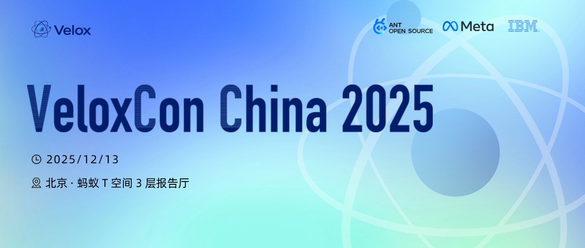

# VeloxCon 2025

近几年，开源数据处理生态在核心功能逐步完善的基础上，正将更多精力投入到性能调优、资源节省和执行层创新上。Velox 作为这一演进中的代表性项目，早已走出单一公司边界，被多家全球领先的企业广泛用于生产环境，支撑从复杂分析、高吞吐写入到 AI 训练数据流水线等多样化场景。

12 月 13 日，首届 VeloxCon China 2025 在北京举行。本次会议由深度参与 Velox 及相关开源项目的一线工程师发起，汇聚来自 Meta、阿里巴巴、腾讯、蚂蚁集团、小米、小红书、IBM、NVIDIA 和英特尔的技术专家，现场分享 Velox 在真实业务中的突破性实践，包括 Gluten 项目如何实现 Spark 查询性能的提升，Velox 与 Iceberg、Paimon 等湖格式深度集成带来的写入效率优化，GPU 加速在实际场景中的落地效果，以及在高并发数据处理中保障系统稳定性的创新方案。

这个仓库包含了历届会议的全部演讲资料，欢迎大家查阅和下载！本次大会内容默认按照 CC BY-SA 4.0 协议授权组织者进行宣传和传播，如有疑问请联系我们。

同时，欢迎关注蚂蚁开源活动，与技术专家和一线开发者交流！

--

In recent years, the open-source data processing ecosystem has moved beyond basic features to focus on performance tuning, cost savings, and execution-layer innovation. Velox is a standout project in this wave, now used in production by many leading global companies. It powers diverse workloads, from complex analytics and high-throughput writes to AI training data pipelines.

On December 13, the first VeloxCon China 2025 was held in Beijing. The event was initiated by engineers deeply involved in Velox and related open-source projects, bringing together experts from Meta, Alibaba, Tencent, Ant Group, Xiaomi, Xiaohongshu, IBM, NVIDIA, and Intel. They shared real-world breakthroughs with Velox: how the Gluten project boosts Spark query performance, how deep integration with lake formats like Iceberg and Paimon improves write efficiency, how GPU acceleration performs in practice, and how to keep systems stable under high concurrency.

This repository contains all the presentation materials from the conference. Feel free to explore and download! The content is licensed under CC BY-SA 4.0 by default for organizers to promote and share. If you have any questions, please contact us.